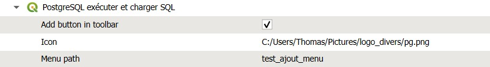

## Ajout d'un bouton qui lance un traitement de la boite à outils

**Problématique : ajouter un bouton dans une barre des tâches qui ouvre un processing**

D'après une discussion de couloir aux rencontres utilisateurs d'Avignon en 2025,
j'ai googélisé et je suis tombé sur la bonne réponse de Pierre mister Gladal.

[https://georezo.net/forum/viewtopic.php?id=130793](https://georezo.net/forum/viewtopic.php?id=130793)

Question ? Est-ce bien documenté dans le doc officielle ?

### Méthodologie

Se rendre dans "Préférences" > "Options" et dans l'onglet *Traitement* on va paramétrer l'activation du bouton, son icône
et *cerise sur la carto* créer / ajouter un menu.

**A ce stade, le boulot est terminé, il suffit d'éteindre / allumer QGIS.**

Enjoy !

### To be continued

Si je veux ajouter un autre raccrouci vers un autre processing, est-ce possible dans le premier menu ?

Et bien OUI !

