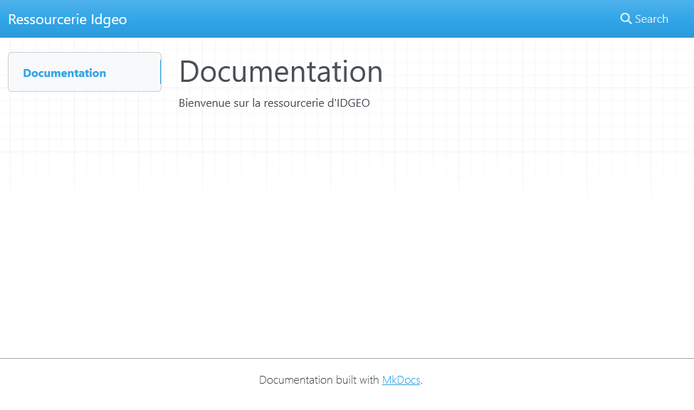
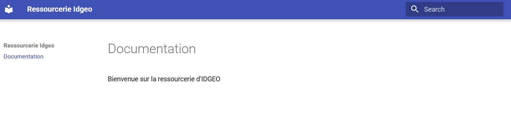

Ressource(rie) d'IDGEO
---------------

Ca fait un moment qu'on cherche un moyen de mettre en place une ressourcerie à destination de nos apprenants.

Voici ce projet sous forme de "github pages", chiche que je mets mes collègues à git !


*Crédit : Image générée avec DALL·E par OpenAI*


## Construction du repo avec mkdocs

Suivi du tuto https://ekite.info/2023/04/27/creer-un-site-web-de-documentation-statique-avec-mkdocs/

### Etape 1 : Repo + prépa arbo
Création de ce repo qui contiendra plusieurs sous dossier. Ce *readme.md* est cette page. 

Le reste de la documentation qui constitue le site 
sera décliné dans les autres fichier de l'arborescence.

On crée donc dans ce projet existant ( ```git init``` seulement el local pour démarrer, on pushera plus tard) le répertoire *mkdocs*.

```bash
mkdir -p docs
```

On ajoute le fichier *mkdocs.yml* pour une conf minimale au départ. On ajoute aussi un fichier *index.md* qui sera la page d'accueil du site.
```tree
.
├── docs
│   └── index.md
├── img
│   ├── globe.jpg
│   └── ressourcerie_gpt.png
├── mkdocs.yml
└── readme.md
```
### Etape 2 : Procédure d'installation de Mkdocs

C'est écrit en python.

On va créer un environnement python dédié à ce repo.

```bash
 python3 -m venv .venv
```
On active l'environnement: 

```bash
source .venv/bin/activate
```
On obtient le passage dans l'environnement virtuel => ``(.venv) thomas@PC-FORM-03:/mnt/d/git_work/ressource_idgeo$``

On installe mkdocs:
```bash
pip install mkdocs
```
On peut déjà tester 
```bash
$ mkdocs serve
INFO    -  Building documentation...
INFO    -  Cleaning site directory
INFO    -  Documentation built in 0.53 seconds
INFO    -  [12:43:17] Watching paths for changes: 'docs', 'mkdocs.yml'
INFO    -  [12:43:17] Serving on http://127.0.0.1:8000/
```

Il sagit du mode preview pour voir le site sur http://127.0.0.1:8000/


### Etape 3 : Installation du thème

Installation du thème ***Material***

```bash
pip install mkdocs-material
```

L'installation se fait et on va modifier le *mkdocs.yml* pour lui préciser qu'on va utiliser ce thème.

```text
# Info du projet
site_name: Ressourcerie Idgeo

# Theme
theme:
name: material
```


**Logo** : on crée un dossier *assets* dans le dossier *docs*

```bash
mkdir docs/assets
```
Pour y mettre le logo du site. il faut ensuite ajouté 
le logo au fichiers de conf mkdocs.yml

```bash
# Theme
theme:
	name: material
	logo : assets/logo.png
```


## Ajout d'une page de documentation sur un sujet

Pour ajouter une page de documentation, il suffit de créer une page 
au format markdown dans le dossier "docs".

Le premier titre "#" de ce fichier est utilisé comme lien dans le menu gauche du site.

## Publication du site

La construction se fait avec la commande.
```bash
mkdocs build
```
Un dossier "site" est généré au même niveau que le dossier "docs".

Il faut ajouter un workflow pour Github Actions qui va rejouer la moulinette lors 
des mises à jour de contenu.